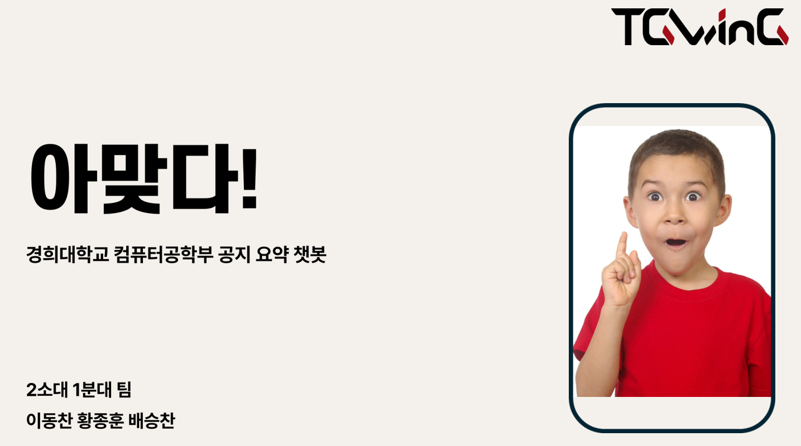
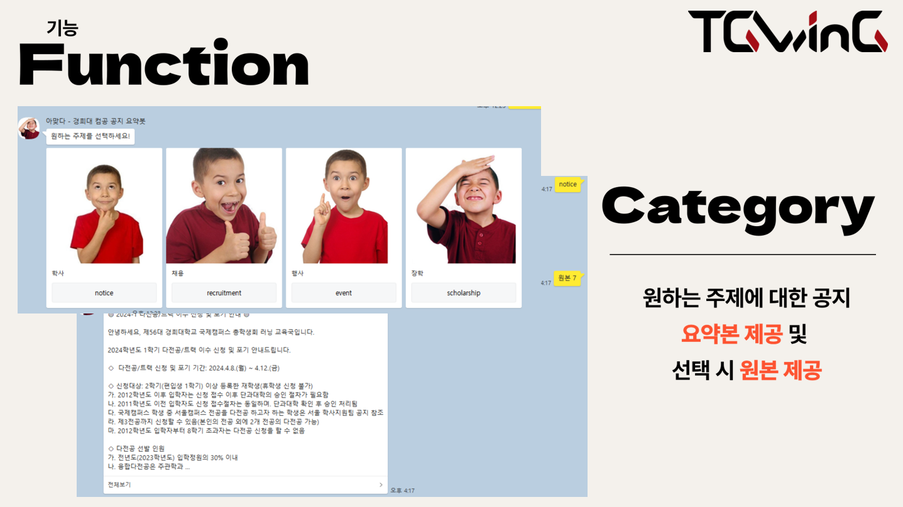
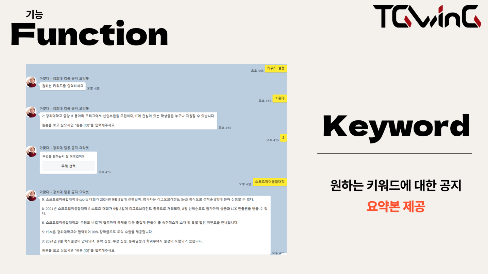

# 📢 amatda.t.g.thon

경희대학교 컴퓨터공학부 공지 요약 챗봇 **아맞다!**  
2024년도 컴퓨터공학부 동아리 **TGwing** 주최 **TGthon** 참가작

---

## 프로젝트 소개

카카오톡 오픈채팅방을 기반으로 학사, 학과, 단과대 공지를 요약해서 보여주는 챗봇
너무 많은 공지 속에서 **내가 원하는 주제**나 **키워드**만 골라서 확인할 수 있도록 서비스 제공

---

## 주요 기능

### 🔹 기능 1: Category 기반 요약
- 원하는 **주제**에 대한 공지를 요약해서 제공  
- 선택 시 원본 공지도 함께 제공

### 🔹 기능 2: Keyword 기반 요약
- 사용자가 원하는 **키워드**에 맞는 공지를 추출하여 요약 제공

---

## 팀원

- **Member**:  
  

---

## 개발

- `아맞다+`

---

## 기획

- 
